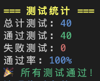

# 编译原理研讨课 project2 实验报告

小组成员：姚永舟 王泽黎 张家玮

---

## 1. 实验任务

1. 实现语义分析和语义检查；
2. 通过遍历语法分析树的方法，实现语法制导翻译；
3. 通过调用 llvm API，生成 IR 代码，并实现解释执行

## 2. 实验设计

### 2.1 语义分析和语义检查

#### 2.1.1 符号表管理

project2 通过 SymbolTable.cpp 实现了完整的符号表系统:

```cpp
class Scope {
    std::map<std::string, std::shared_ptr<SymbolInfo>> symbols;
    Scope* parent_scope;
    bool is_function_scope;
    bool is_loop_scope;
};
```

#### 2.1.2 作用域管理

- 支持嵌套作用域，每个作用域维护一个符号表
- 区分函数作用域和循环作用域，用于控制流验证
- 实现符号查找的作用域链机制

#### 2.1.3 类型系统

通过 Type 结构实现了完整的类型系统：

```cpp
struct Type {
    enum Base { UNKNOWN, INT, FLOAT, CHAR, VOID, ARRAY, FUNCTION, ERROR_TYPE } baseType;
    std::shared_ptr<Type> elementType; // 数组元素类型或函数返回类型
    std::vector<int> dimensions;       // 数组维度
    std::vector<std::shared_ptr<Type>> paramTypes; // 函数参数类型
    bool isConst = false;
    bool isLValue = false;
};
```

#### 2.1.4 语义检查

SemanticAnalyzer 类继承 CactParserBaseVisitor，实现访问者模式进行语义检查

主要检查项目：

  1. 变量声明检查：重定义、类型兼容性
  2. 表达式类型检查：操作符类型匹配、隐式转换限制
  3. 函数调用验证：参数个数、类型匹配
  4. 控制流分析：return语句、break/continue的上下文检查
  5. 常量表达式求值：编译时常量的计算和验证

```cpp
// 表达式类型检查示例
antlrcpp::Any SemanticAnalyzer::visitAddExpression(CactParser::AddExpressionContext *ctx) {
    if (ctx->addExpression()) {
        std::shared_ptr<Type> left = std::any_cast<std::shared_ptr<Type>>(visitAddExpression(ctx->addExpression()));
        std::shared_ptr<Type> right = std::any_cast<std::shared_ptr<Type>>(visitMultiplicativeExpression(ctx->multiplicativeExpression()));
        
        // 类型错误传播
        if (left->baseType == Type::ERROR_TYPE || right->baseType == Type::ERROR_TYPE) {
            return left;
        }
        
        // 数值类型检查
        if (!((left->baseType == Type::INT || left->baseType == Type::FLOAT) &&
              (right->baseType == Type::INT || right->baseType == Type::FLOAT))) {
            addError("Addition requires numeric operands.", ctx->getStart());
            return Type::getError();
        }
        
        // CACT不支持隐式类型转换
        if (left->baseType != right->baseType) {
            addError("Type mismatch in addition operation.", ctx->getStart());
            return Type::getError();
        }
        
        return std::make_shared<Type>(*left);
    }
}
```

### 2.2 语法制导翻译

#### 2.2.1 访问者模式

项目采用访问者模式遍历抽象语法树，实现语法制导翻译：

```cpp
class SemanticAnalyzer : public CactParserBaseVisitor {
public:
    // 为每个语法规则实现对应的visit方法
    antlrcpp::Any visitCompilationUnit(CactParser::CompilationUnitContext *ctx) override;
    antlrcpp::Any visitFunctionDefinition(CactParser::FunctionDefinitionContext *ctx) override;
    antlrcpp::Any visitExpression(CactParser::ExpressionContext *ctx) override;
    // ... 其他visit方法
};
```

#### 2.2.2 属性文法

通过antlrcpp::Any返回值传递综合属性：

```cpp
// 类型信息作为综合属性向上传递
antlrcpp::Any SemanticAnalyzer::visitNumber(CactParser::NumberContext *ctx) {
    if (ctx->IntegerConstant()) return Type::getInt();
    if (ctx->FloatConstant()) return Type::getFloat();
    if (ctx->CharacterConstant()) return Type::getChar();
    return Type::getError();
}
```

通过成员变量维护继承属性：

```cpp
class SemanticAnalyzer {
private:
    Scope* currentScope;  // 当前作用域上下文
    std::shared_ptr<SymbolInfo> currentFunctionSymbol; // 当前函数上下文
    bool expectingConstantInitializer; // 常量初始化上下文
    bool inConditionContext; // 条件表达式上下文
};
```

#### 2.2.3 翻译方案

- 自底向上：表达式求值、类型推导
- 自顶向下：作用域管理、上下文传递
- 中间代码生成：在语义检查通过后进行IR生成

### 2.3 LLVM IR代码生成和执行

#### 2.3.1 IR生成器架构

IRGenerator 类同样采用访问者模式，在语义分析通过后生成LLVM IR：

```cpp
class IRGenerator : public CactParserBaseVisitor {
private:
    std::unique_ptr<llvm::LLVMContext> context;
    std::unique_ptr<llvm::Module> module;
    std::unique_ptr<llvm::IRBuilder<>> builder;
    std::map<std::string, llvm::Value*> variables; // 变量映射表
};
```

#### 2.3.2 作用域变量管理

使用栈结构管理嵌套作用域中的变量：

```cpp
// 作用域栈：每个作用域维护一个变量表
std::stack<std::map<std::string, llvm::Value*>> variableScopes;
std::map<std::string, llvm::Value*>* currentVariables; // 当前作用域变量表

void IRGenerator::enterScope() {
    variableScopes.push(std::map<std::string, llvm::Value*>());
    currentVariables = &variableScopes.top();
}

void IRGenerator::exitScope() {
    if (!variableScopes.empty()) {
        variableScopes.pop();
        currentVariables = variableScopes.empty() ? nullptr : &variableScopes.top();
    }
}
```

#### 2.3.3 函数定义和调用

```cpp
antlrcpp::Any IRGenerator::visitFunctionDefinition(CactParser::FunctionDefinitionContext *ctx) {
    // 1. 创建函数类型
    llvm::Type* retType = getCactType(returnType);
    std::vector<llvm::Type*> paramTypes;
    // ... 参数类型处理
    
    llvm::FunctionType* funcType = llvm::FunctionType::get(retType, paramTypes, false);
    
    // 2. 创建函数
    currentFunction = llvm::Function::Create(funcType, llvm::Function::ExternalLinkage, functionName, module.get());
    
    // 3. 创建入口基本块
    llvm::BasicBlock* entryBlock = llvm::BasicBlock::Create(*context, "entry", currentFunction);
    builder->SetInsertPoint(entryBlock);
    
    // 4. 处理函数参数
    enterScope(); // 创建函数作用域
    auto argIter = currentFunction->arg_begin();
    for (size_t i = 0; i < paramNames.size(); ++i, ++argIter) {
        llvm::Argument* arg = &(*argIter);
        llvm::AllocaInst* paramAlloca = builder->CreateAlloca(arg->getType(), nullptr, paramNames[i]);
        builder->CreateStore(arg, paramAlloca);
        defineVariable(paramNames[i], paramAlloca);
    }
    
    // 5. 处理函数体
    visit(ctx->block());
    exitScope();
}
```

#### 2.3.4 表达式和语句翻译

```cpp
// 算术表达式
antlrcpp::Any IRGenerator::visitAddExpression(CactParser::AddExpressionContext *ctx) {
    if (ctx->addExpression() && ctx->multiplicativeExpression()) {
        llvm::Value* left = std::any_cast<llvm::Value*>(visit(ctx->addExpression()));
        llvm::Value* right = std::any_cast<llvm::Value*>(visit(ctx->multiplicativeExpression()));
        
        if (ctx->Plus()) {
            return builder->CreateAdd(left, right);
        } else { // Minus
            return builder->CreateSub(left, right);
        }
    }
}

// 条件语句
antlrcpp::Any IRGenerator::visitStatement(CactParser::StatementContext *ctx) {
    if (ctx->If()) {
        // 创建基本块
        llvm::BasicBlock* thenBlock = llvm::BasicBlock::Create(*context, "if.then", currentFunction);
        llvm::BasicBlock* elseBlock = ctx->Else() ? 
            llvm::BasicBlock::Create(*context, "if.else", currentFunction) : nullptr;
        llvm::BasicBlock* endBlock = llvm::BasicBlock::Create(*context, "if.end", currentFunction);
        
        // 处理条件
        llvm::Value* condition = std::any_cast<llvm::Value*>(visit(ctx->condition()));
        
        // 创建条件分支
        if (elseBlock) {
            builder->CreateCondBr(condition, thenBlock, elseBlock);
        } else {
            builder->CreateCondBr(condition, thenBlock, endBlock);
        }
        
        // 处理then分支
        builder->SetInsertPoint(thenBlock);
        visit(ctx->statement()[0]);
        builder->CreateBr(endBlock);
        
        // 处理else分支
        if (elseBlock) {
            builder->SetInsertPoint(elseBlock);
            visit(ctx->statement()[1]);
            builder->CreateBr(endBlock);
        }
        
        builder->SetInsertPoint(endBlock);
    }
}
```

#### 2.3.5 优化和执行

```cpp
void IRGenerator::optimizeIR() {
    // 创建优化Pass管理器
    FPM = std::make_unique<llvm::FunctionPassManager>();
    
    // 添加优化Pass
    FPM->addPass(llvm::InstCombinePass());  // 指令合并
    FPM->addPass(llvm::SimplifyCFGPass());  // 控制流简化
    FPM->addPass(llvm::GVNPass());          // 全局值编号
    FPM->addPass(llvm::SCCPPass());         // 稀疏条件常数传播
    
    // 对每个函数运行优化
    for (auto &F : *module) {
        if (!F.isDeclaration()) {
            FPM->run(F, *FAM);
        }
    }
}
```

## 3. 实验流程总结

1. 语义分析：访问者模式遍历AST，进行类型检查和符号表管理
2. IR代码生成：再次遍历AST，调用LLVM API生成中间代码
3. 优化执行：应用LLVM优化Pass，输出优化后的IR代码

## 4. 实验结果



## 5. 实验心得

本次实验深入理解了编译器的语义分析和代码生成过程，掌握了LLVM IR的基本使用方法。通过实现符号表、类型系统和IR生成器，体会到编译器设计的复杂性和灵活性。同时，访问者模式在AST遍历中的应用也让我们对设计模式有了更深刻的认识。此外，这是一个非常好的实操学习 C++ 这一强大的编程语言的机会。
